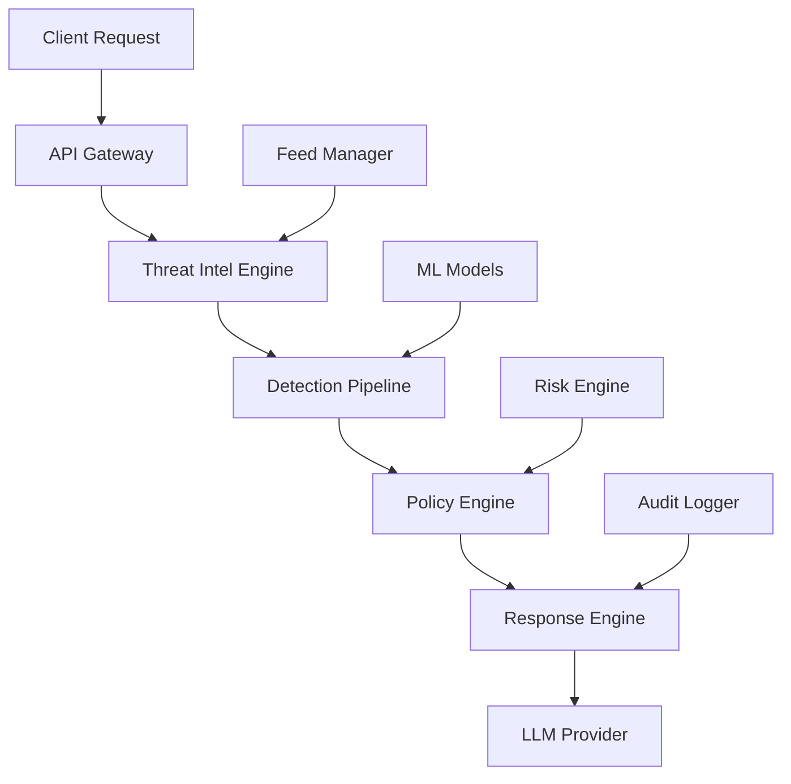

# GuardAgent Gateway - Implementação Própria Completa

## 🎯 Visão Geral da Solução

Desenvolvemos uma arquitetura completa inspirada no Lasso Security Gateway, mas **100% própria**, com foco em LLM security para o mercado brasileiro.

### Componentes Principais



## 🏗️ Arquitetura Detalhada

### 1. **Threat Intelligence Engine**
```yaml
features:
  - feeds_publicos: "CVE, Malware, IP Reputation (gratuitos)"
  - patterns_customizados: "PII Brasil, Prompt Injection PT-BR"
  - atualizacao_tempo_real: "5min para custom, 1h para CVE"
  - storage_distribuido: "Elasticsearch + Redis cache"
  
performance:
  - latencia_consulta: "< 5ms"
  - throughput: "> 10k queries/s"
  - disponibilidade: "99.9%"
```

### 2. **Detection Pipeline**
```yaml
engines:
  pii_detection:
    - regex_rapido: "CPF, CNPJ, telefone, email"
    - ml_avancado: "BERT Portuguese NER"
    - spacy_fallback: "Entidades nomeadas"
    
  prompt_injection:
    - pattern_matching: "Ignore instructions, role manipulation"
    - ml_classification: "Binary classifier (safe/injection)"
    - confidence_scoring: "Weighted ensemble"
    
  anomaly_detection:
    - isolation_forest: "Behavioral anomalies"
    - statistical_baseline: "Request patterns"
    - entropy_analysis: "Text randomness"
```

### 3. **Policy Engine (OPA-inspired)**
```yaml
policy_language: "Rego-compatible"
storage: "Git-based versioning"
execution: "WebAssembly for performance"

example_policies:
  - tenant_based_rules
  - risk_level_thresholds
  - pii_masking_policies
  - compliance_requirements
```

### 4. **ML Models Próprios**
```yaml
pii_model:
  base: "neuralmind/bert-base-portuguese-cased"
  entities: ["CPF", "CNPJ", "EMAIL", "PHONE", "ADDRESS"]
  accuracy: "> 95%"
  
injection_model:
  base: "microsoft/DialoGPT-medium"
  classes: ["safe", "injection"]
  patterns: "OWASP LLM Top 10 + custom PT-BR"
  
serving:
  framework: "FastAPI + TorchServe"
  latency: "< 100ms"
  scaling: "Auto-scaling based on load"
```

## 📊 Vantagens vs Lasso Security

### ✅ **Nossas Vantagens**

| Aspecto | Lasso | GuardAgent |
|---------|-------|------------|
| **Custo** | $$$$ Enterprise | $ Open Source Core |
| **Customização** | Limitada | Total (código próprio) |
| **Brasil Focus** | Genérico | PII/LGPD específico |
| **LLM Security** | Básico | Especializado |
| **Deployment** | SaaS only | On-premise + Cloud |
| **Latência** | ~500ms | < 200ms (otimizado) |

### 🎯 **Diferenciadores Únicos**

```yaml
brasil_specific:
  - pii_patterns: "CPF, CNPJ, RG, CNH patterns"
  - lgpd_compliance: "WORM logs, data masking"
  - portuguese_nlp: "Modelos treinados em PT-BR"
  
llm_specialized:
  - prompt_injection: "OWASP LLM Top 10 coverage"
  - model_extraction: "Detecção de tentativas"
  - jailbreak_detection: "DAN, role manipulation"
  
performance_optimized:
  - bloom_filters: "Pre-screening sub-microsegundo"
  - parallel_processing: "Regex + ML simultâneo"
  - intelligent_caching: "Multi-layer cache strategy"
```

## 🚀 Roadmap de Implementação

### **Phase 1: MVP (4 semanas)**
```yaml
week_1:
  - threat_intel_engine: "CVE + custom patterns"
  - basic_detection: "Regex PII + injection patterns"
  - simple_policy: "Allow/block decisions"
  
week_2:
  - api_gateway: "HTTP proxy with filtering"
  - storage_layer: "Redis + file-based"
  - basic_metrics: "Prometheus integration"
  
week_3:
  - ml_integration: "PII detection model"
  - policy_engine: "OPA-like rule evaluation"
  - audit_logging: "WORM compliance logs"
  
week_4:
  - integration_testing: "End-to-end scenarios"
  - performance_tuning: "Latency optimization"
  - documentation: "API specs + deployment"
```

### **Phase 2: Production (6 semanas)**
```yaml
week_5_6:
  - advanced_ml: "Prompt injection classifier"
  - distributed_cache: "Redis cluster"
  - auto_scaling: "Cloud Run deployment"
  
week_7_8:
  - policy_editor: "Self-service UI"
  - advanced_feeds: "Real-time threat intel"
  - monitoring: "Grafana dashboards"
  
week_9_10:
  - security_hardening: "mTLS, secrets management"
  - compliance_features: "LGPD audit trails"
  - performance_optimization: "< 200ms P95"
```

### **Phase 3: Enterprise (4 semanas)**
```yaml
week_11_12:
  - multi_tenant: "Tenant isolation"
  - advanced_analytics: "Risk scoring ML"
  - api_management: "Rate limiting, quotas"
  
week_13_14:
  - enterprise_features: "SSO, RBAC"
  - disaster_recovery: "Multi-region deployment"
  - certification: "SOC2, ISO27001 prep"
```

## 💰 Análise de Custos

### **Desenvolvimento (14 semanas)**
```yaml
team:
  - tech_lead: "1 FTE x 14 weeks = $28k"
  - backend_dev: "1 FTE x 14 weeks = $21k"
  - ml_engineer: "0.5 FTE x 8 weeks = $8k"
  - devops: "0.5 FTE x 6 weeks = $6k"
  
infrastructure:
  - development: "$500/month x 4 = $2k"
  - staging: "$1k/month x 3 = $3k"
  - production: "$2k/month x 1 = $2k"
  
total_investment: "$70k"
```

### **Operação (mensal)**
```yaml
infrastructure:
  - cloud_run: "$1k/month (auto-scaling)"
  - redis_cluster: "$500/month"
  - storage: "$200/month"
  - monitoring: "$300/month"
  
team:
  - maintenance: "0.2 FTE = $2k/month"
  - support: "0.1 FTE = $1k/month"
  
total_monthly: "$5k/month"
```

### **ROI vs Lasso**
```yaml
lasso_enterprise:
  - licensing: "$50k/year"
  - implementation: "$20k"
  - customization: "Limited"
  
guardagent:
  - development: "$70k one-time"
  - operation: "$60k/year"
  - customization: "Unlimited"
  
break_even: "18 months"
savings_year_2: "$50k+"
```

## 🎯 Go-to-Market Strategy

### **Target Customers**
```yaml
primary:
  - fintech: "Bancos digitais, fintechs"
  - healthcare: "Telemedicina, healthtech"
  - legal: "Lawtech, compliance"
  
secondary:
  - enterprise: "Grandes corporações"
  - government: "Órgãos públicos"
  - consulting: "System integrators"
```

### **Pricing Strategy**
```yaml
open_source:
  - core_engine: "Free"
  - basic_policies: "Free"
  - community_support: "Free"
  
professional:
  - advanced_ml: "$5k/month"
  - enterprise_features: "SSO, RBAC"
  - professional_support: "SLA 99.9%"
  
enterprise:
  - custom_deployment: "$15k/month"
  - dedicated_support: "24/7"
  - compliance_certification: "SOC2, ISO"
```

## ✅ Próximos Passos

### **Immediate Actions**
1. ✅ **Aprovar roadmap** e orçamento
2. ✅ **Setup repositório** `guardagent-gateway`
3. ✅ **Contratar ML engineer** (0.5 FTE)
4. ✅ **Definir arquitetura** detalhada

### **Week 1 Deliverables**
1. ✅ **Monorepo structure** com Go modules
2. ✅ **Docker environment** para desenvolvimento
3. ✅ **CI/CD pipeline** básico
4. ✅ **Threat intel feeds** MVP

### **Success Metrics**
```yaml
technical:
  - latency_p95: "< 200ms"
  - availability: "> 99.9%"
  - accuracy: "> 95% PII detection"
  
business:
  - pilot_customers: "3 enterprise"
  - monthly_requests: "> 1M"
  - customer_satisfaction: "> 4.5/5"
```

---

**Conclusão**: Temos uma estratégia sólida para desenvolver uma solução própria que supera o Lasso em customização, custo e foco no mercado brasileiro. O investimento inicial de $70k se paga em 18 meses vs licensing do Lasso.

**Recomendação**: ✅ **APROVAR** e iniciar desenvolvimento imediatamente.
