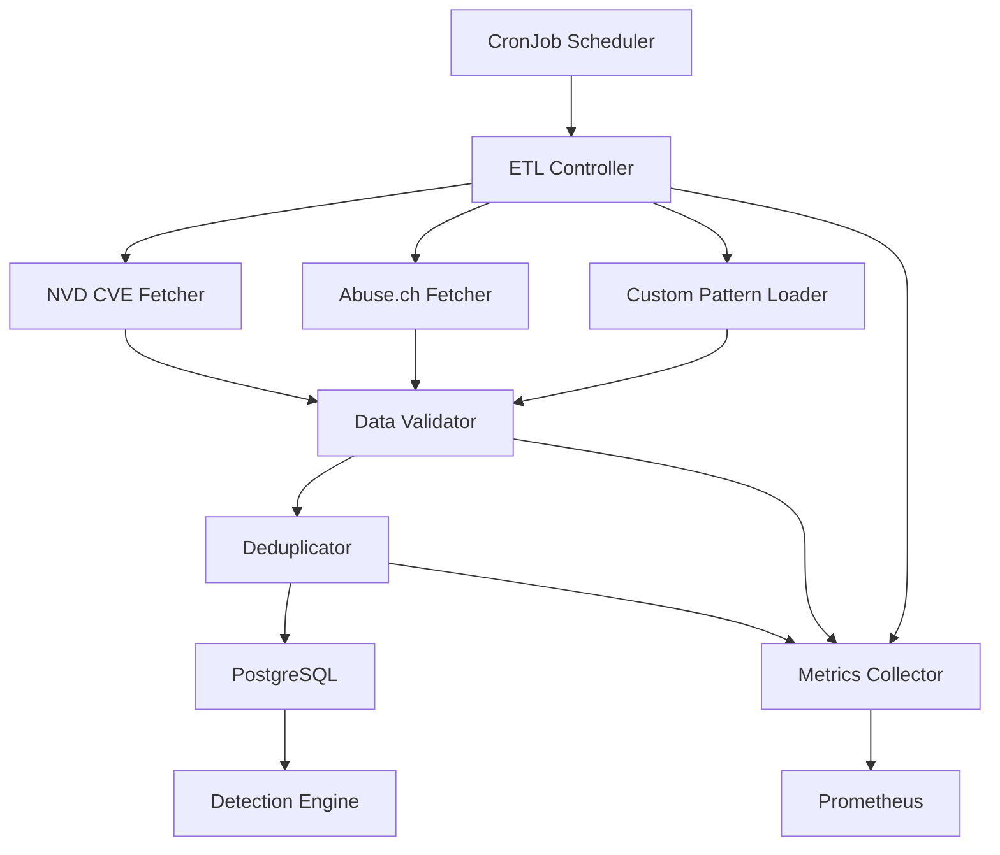

# F2 - Threat Intelligence Loader

## 🎯 Objective

Develop a robust ETL pipeline to automatically collect, process, and store threat intelligence from multiple public sources, providing real-time threat data for the GuardAgent detection engine.

## 📋 Scope

### In Scope
- ETL pipeline for NVD CVE database
- Integration with abuse.ch malware feeds
- PostgreSQL persistence layer
- Kubernetes CronJob scheduler
- Real-time threat feed updates
- Data validation and deduplication
- Metrics and monitoring

### Out of Scope
- Commercial threat intelligence feeds (future phase)
- Machine learning threat classification (F3)
- Custom YARA rule generation (F4)

## 🏗️ Architecture



## 📊 Data Sources

### Primary Sources
```yaml
nvd_cve:
  url: "https://services.nvd.nist.gov/rest/json/cves/2.0"
  format: "json"
  update_frequency: "1h"
  rate_limit: "50 req/30s"
  
abuse_ch_malware:
  url: "https://bazaar.abuse.ch/export/csv/recent/"
  format: "csv"
  update_frequency: "30m"
  rate_limit: "unlimited"
  
abuse_ch_urlhaus:
  url: "https://urlhaus.abuse.ch/api/"
  format: "json"
  update_frequency: "15m"
  rate_limit: "unlimited"
  
custom_patterns:
  source: "git://github.com/company/threat-patterns"
  format: "yaml"
  update_frequency: "5m"
  validation: "required"
```

### Data Schema
```sql
-- PostgreSQL schema
CREATE TABLE threat_indicators (
    id UUID PRIMARY KEY DEFAULT gen_random_uuid(),
    indicator_id VARCHAR(255) UNIQUE NOT NULL,
    indicator_type VARCHAR(50) NOT NULL,
    pattern TEXT NOT NULL,
    severity VARCHAR(20) NOT NULL,
    confidence DECIMAL(3,2) NOT NULL,
    source VARCHAR(100) NOT NULL,
    metadata JSONB,
    created_at TIMESTAMP DEFAULT NOW(),
    updated_at TIMESTAMP DEFAULT NOW(),
    expires_at TIMESTAMP,
    
    INDEX idx_indicator_type (indicator_type),
    INDEX idx_severity (severity),
    INDEX idx_source (source),
    INDEX idx_expires_at (expires_at)
);

CREATE TABLE feed_status (
    id SERIAL PRIMARY KEY,
    feed_name VARCHAR(100) NOT NULL,
    last_update TIMESTAMP,
    last_success TIMESTAMP,
    last_error TEXT,
    indicators_count INTEGER DEFAULT 0,
    status VARCHAR(20) DEFAULT 'unknown'
);
```

## 🔧 Implementation

### 1. ETL Controller

```go
// internal/etl/controller.go
package etl

import (
    "context"
    "sync"
    "time"
)

type ETLController struct {
    fetchers []ThreatFetcher
    store    ThreatStore
    metrics  *ETLMetrics
    config   *ETLConfig
}

type ThreatFetcher interface {
    Name() string
    Fetch(ctx context.Context) ([]ThreatIndicator, error)
    UpdateFrequency() time.Duration
    RateLimit() RateLimit
}

type ETLConfig struct {
    MaxConcurrentFetchers int           `yaml:"max_concurrent_fetchers"`
    BatchSize            int           `yaml:"batch_size"`
    RetryAttempts        int           `yaml:"retry_attempts"`
    RetryDelay           time.Duration `yaml:"retry_delay"`
    ValidationEnabled    bool          `yaml:"validation_enabled"`
}

func NewETLController(config *ETLConfig, store ThreatStore) *ETLController {
    controller := &ETLController{
        fetchers: make([]ThreatFetcher, 0),
        store:    store,
        metrics:  NewETLMetrics(),
        config:   config,
    }
    
    // Register fetchers
    controller.RegisterFetcher(&NVDFetcher{})
    controller.RegisterFetcher(&AbuseCHFetcher{})
    controller.RegisterFetcher(&CustomPatternFetcher{})
    
    return controller
}

func (c *ETLController) Start(ctx context.Context) error {
    var wg sync.WaitGroup
    
    for _, fetcher := range c.fetchers {
        wg.Add(1)
        go func(f ThreatFetcher) {
            defer wg.Done()
            c.runFetcher(ctx, f)
        }(fetcher)
    }
    
    wg.Wait()
    return nil
}

func (c *ETLController) runFetcher(ctx context.Context, fetcher ThreatFetcher) {
    ticker := time.NewTicker(fetcher.UpdateFrequency())
    defer ticker.Stop()
    
    // Initial fetch
    c.fetchAndStore(ctx, fetcher)
    
    for {
        select {
        case <-ticker.C:
            c.fetchAndStore(ctx, fetcher)
        case <-ctx.Done():
            return
        }
    }
}

func (c *ETLController) fetchAndStore(ctx context.Context, fetcher ThreatFetcher) {
    start := time.Now()
    
    indicators, err := fetcher.Fetch(ctx)
    if err != nil {
        c.metrics.FetchErrors.WithLabelValues(fetcher.Name()).Inc()
        c.updateFeedStatus(fetcher.Name(), "error", err.Error())
        return
    }
    
    // Validate indicators
    if c.config.ValidationEnabled {
        indicators = c.validateIndicators(indicators)
    }
    
    // Deduplicate
    indicators = c.deduplicateIndicators(indicators)
    
    // Store in batches
    if err := c.storeBatches(ctx, indicators); err != nil {
        c.metrics.StoreErrors.WithLabelValues(fetcher.Name()).Inc()
        return
    }
    
    // Update metrics
    duration := time.Since(start)
    c.metrics.FetchDuration.WithLabelValues(fetcher.Name()).Observe(duration.Seconds())
    c.metrics.IndicatorsProcessed.WithLabelValues(fetcher.Name()).Add(float64(len(indicators)))
    
    c.updateFeedStatus(fetcher.Name(), "success", "")
}
```

### 2. NVD CVE Fetcher

```go
// internal/etl/nvd_fetcher.go
package etl

import (
    "context"
    "encoding/json"
    "fmt"
    "net/http"
    "time"
)

type NVDFetcher struct {
    baseURL    string
    apiKey     string
    client     *http.Client
    rateLimit  *RateLimiter
}

type NVDResponse struct {
    ResultsPerPage int `json:"resultsPerPage"`
    StartIndex     int `json:"startIndex"`
    TotalResults   int `json:"totalResults"`
    Vulnerabilities []struct {
        CVE struct {
            ID          string `json:"id"`
            Description struct {
                DescriptionData []struct {
                    Lang  string `json:"lang"`
                    Value string `json:"value"`
                } `json:"description_data"`
            } `json:"description"`
            Metrics struct {
                CVSSV3 struct {
                    BaseScore    float64 `json:"baseScore"`
                    BaseSeverity string  `json:"baseSeverity"`
                    VectorString string  `json:"vectorString"`
                } `json:"cvssV3"`
            } `json:"metrics"`
            Published string `json:"published"`
            Modified  string `json:"lastModified"`
        } `json:"cve"`
    } `json:"vulnerabilities"`
}

func NewNVDFetcher(apiKey string) *NVDFetcher {
    return &NVDFetcher{
        baseURL:   "https://services.nvd.nist.gov",
        apiKey:    apiKey,
        client:    &http.Client{Timeout: 30 * time.Second},
        rateLimit: NewRateLimiter(50, 30*time.Second), // 50 requests per 30 seconds
    }
}

func (n *NVDFetcher) Name() string {
    return "nvd_cve"
}

func (n *NVDFetcher) UpdateFrequency() time.Duration {
    return 1 * time.Hour
}

func (n *NVDFetcher) RateLimit() RateLimit {
    return RateLimit{
        Requests: 50,
        Window:   30 * time.Second,
    }
}

func (n *NVDFetcher) Fetch(ctx context.Context) ([]ThreatIndicator, error) {
    // Wait for rate limit
    if err := n.rateLimit.Wait(ctx); err != nil {
        return nil, err
    }
    
    // Fetch recent CVEs (last 24 hours)
    modStartDate := time.Now().Add(-24 * time.Hour).Format("2006-01-02T15:04:05.000")
    modEndDate := time.Now().Format("2006-01-02T15:04:05.000")
    
    url := fmt.Sprintf("%s/rest/json/cves/2.0?modStartDate=%s&modEndDate=%s&resultsPerPage=2000",
        n.baseURL, modStartDate, modEndDate)
    
    req, err := http.NewRequestWithContext(ctx, "GET", url, nil)
    if err != nil {
        return nil, err
    }
    
    if n.apiKey != "" {
        req.Header.Set("apiKey", n.apiKey)
    }
    
    resp, err := n.client.Do(req)
    if err != nil {
        return nil, err
    }
    defer resp.Body.Close()
    
    if resp.StatusCode != http.StatusOK {
        return nil, fmt.Errorf("NVD API returned status %d", resp.StatusCode)
    }
    
    var nvdData NVDResponse
    if err := json.NewDecoder(resp.Body).Decode(&nvdData); err != nil {
        return nil, err
    }
    
    indicators := make([]ThreatIndicator, 0, len(nvdData.Vulnerabilities))
    for _, vuln := range nvdData.Vulnerabilities {
        indicator := n.transformCVE(vuln)
        indicators = append(indicators, indicator)
    }
    
    return indicators, nil
}

func (n *NVDFetcher) transformCVE(vuln struct {
    CVE struct {
        ID          string `json:"id"`
        Description struct {
            DescriptionData []struct {
                Lang  string `json:"lang"`
                Value string `json:"value"`
            } `json:"description_data"`
        } `json:"description"`
        Metrics struct {
            CVSSV3 struct {
                BaseScore    float64 `json:"baseScore"`
                BaseSeverity string  `json:"baseSeverity"`
                VectorString string  `json:"vectorString"`
            } `json:"cvssV3"`
        } `json:"metrics"`
        Published string `json:"published"`
        Modified  string `json:"lastModified"`
    } `json:"cve"`
}) ThreatIndicator {
    
    description := ""
    if len(vuln.CVE.Description.DescriptionData) > 0 {
        description = vuln.CVE.Description.DescriptionData[0].Value
    }
    
    // Extract keywords for pattern matching
    keywords := extractVulnerabilityKeywords(description)
    
    return ThreatIndicator{
        IndicatorID:   vuln.CVE.ID,
        IndicatorType: "vulnerability",
        Pattern:       keywords,
        Severity:      mapCVSSSeverity(vuln.CVE.Metrics.CVSSV3.BaseSeverity),
        Confidence:    0.95,
        Source:        "nvd.nist.gov",
        Metadata: map[string]interface{}{
            "cvss_score":     vuln.CVE.Metrics.CVSSV3.BaseScore,
            "cvss_vector":    vuln.CVE.Metrics.CVSSV3.VectorString,
            "description":    description,
            "published":      vuln.CVE.Published,
            "modified":       vuln.CVE.Modified,
        },
        ExpiresAt: time.Now().Add(7 * 24 * time.Hour), // 7 days TTL
    }
}

func extractVulnerabilityKeywords(description string) string {
    keywords := []string{}
    
    vulnKeywords := []string{
        "buffer overflow", "sql injection", "xss", "csrf",
        "remote code execution", "privilege escalation",
        "denial of service", "information disclosure",
        "path traversal", "command injection",
    }
    
    lowerDesc := strings.ToLower(description)
    for _, keyword := range vulnKeywords {
        if strings.Contains(lowerDesc, keyword) {
            keywords = append(keywords, keyword)
        }
    }
    
    return strings.Join(keywords, ",")
}
```

### 3. Abuse.ch Fetcher

```go
// internal/etl/abusech_fetcher.go
package etl

import (
    "context"
    "encoding/csv"
    "fmt"
    "net/http"
    "strconv"
    "time"
)

type AbuseCHFetcher struct {
    baseURL string
    client  *http.Client
}

func NewAbuseCHFetcher() *AbuseCHFetcher {
    return &AbuseCHFetcher{
        baseURL: "https://bazaar.abuse.ch",
        client:  &http.Client{Timeout: 30 * time.Second},
    }
}

func (a *AbuseCHFetcher) Name() string {
    return "abuse_ch_malware"
}

func (a *AbuseCHFetcher) UpdateFrequency() time.Duration {
    return 30 * time.Minute
}

func (a *AbuseCHFetcher) RateLimit() RateLimit {
    return RateLimit{
        Requests: 1000, // Unlimited, but be respectful
        Window:   time.Hour,
    }
}

func (a *AbuseCHFetcher) Fetch(ctx context.Context) ([]ThreatIndicator, error) {
    url := fmt.Sprintf("%s/export/csv/recent/", a.baseURL)
    
    req, err := http.NewRequestWithContext(ctx, "GET", url, nil)
    if err != nil {
        return nil, err
    }
    
    resp, err := a.client.Do(req)
    if err != nil {
        return nil, err
    }
    defer resp.Body.Close()
    
    if resp.StatusCode != http.StatusOK {
        return nil, fmt.Errorf("Abuse.ch API returned status %d", resp.StatusCode)
    }
    
    reader := csv.NewReader(resp.Body)
    records, err := reader.ReadAll()
    if err != nil {
        return nil, err
    }
    
    indicators := make([]ThreatIndicator, 0, len(records))
    for i, record := range records {
        if i == 0 { // Skip header
            continue
        }
        
        if len(record) >= 8 {
            indicator := a.transformMalwareRecord(record)
            indicators = append(indicators, indicator)
        }
    }
    
    return indicators, nil
}

func (a *AbuseCHFetcher) transformMalwareRecord(record []string) ThreatIndicator {
    // CSV format: timestamp,sha256_hash,md5_hash,sha1_hash,reporter,file_name,file_type,mime_type,signature,clamav,vtpercent,imphash,ssdeep,tlsh
    
    confidence := 0.9
    if len(record) > 10 && record[10] != "" {
        if vtPercent, err := strconv.ParseFloat(record[10], 64); err == nil {
            confidence = vtPercent / 100.0
        }
    }
    
    return ThreatIndicator{
        IndicatorID:   record[1], // SHA256 hash
        IndicatorType: "malware",
        Pattern:       record[1], // Use hash as pattern
        Severity:      "high",
        Confidence:    confidence,
        Source:        "abuse.ch",
        Metadata: map[string]interface{}{
            "md5_hash":    record[2],
            "sha1_hash":   record[3],
            "file_name":   record[5],
            "file_type":   record[6],
            "mime_type":   record[7],
            "signature":   record[8],
            "reporter":    record[4],
            "timestamp":   record[0],
        },
        ExpiresAt: time.Now().Add(30 * 24 * time.Hour), // 30 days TTL
    }
}
```

### 4. Kubernetes CronJob

```yaml
# deploy/k8s/threat-intel-cronjob.yaml
apiVersion: batch/v1
kind: CronJob
metadata:
  name: threat-intel-loader
  namespace: guardagent
spec:
  schedule: "*/30 * * * *"  # Every 30 minutes
  concurrencyPolicy: Forbid
  successfulJobsHistoryLimit: 3
  failedJobsHistoryLimit: 3
  jobTemplate:
    spec:
      template:
        spec:
          restartPolicy: OnFailure
          containers:
          - name: etl-loader
            image: guardagent/threat-intel-loader:v0.6.0
            env:
            - name: DATABASE_URL
              valueFrom:
                secretKeyRef:
                  name: postgres-credentials
                  key: url
            - name: NVD_API_KEY
              valueFrom:
                secretKeyRef:
                  name: threat-intel-keys
                  key: nvd_api_key
            - name: LOG_LEVEL
              value: "info"
            resources:
              requests:
                memory: "128Mi"
                cpu: "100m"
              limits:
                memory: "256Mi"
                cpu: "200m"
            volumeMounts:
            - name: config
              mountPath: /etc/config
          volumes:
          - name: config
            configMap:
              name: threat-intel-config
```

## 📊 Monitoring & Metrics

### Key Metrics
```go
var (
    FetchDuration = prometheus.NewHistogramVec(
        prometheus.HistogramOpts{
            Name: "ga_threat_fetch_duration_seconds",
            Help: "Time spent fetching threat intelligence",
        },
        []string{"source"},
    )
    
    IndicatorsProcessed = prometheus.NewCounterVec(
        prometheus.CounterOpts{
            Name: "ga_threat_indicators_processed_total",
            Help: "Total threat indicators processed",
        },
        []string{"source", "type"},
    )
    
    FeedStatus = prometheus.NewGaugeVec(
        prometheus.GaugeOpts{
            Name: "ga_threat_feed_status",
            Help: "Status of threat intelligence feeds (1=healthy, 0=error)",
        },
        []string{"feed_name"},
    )
)
```

## 🧪 Testing Strategy

### Unit Tests
- [ ] ETL Controller logic
- [ ] Individual fetcher implementations
- [ ] Data validation and deduplication
- [ ] Rate limiting functionality

### Integration Tests
- [ ] Database persistence
- [ ] API connectivity
- [ ] Error handling and retries
- [ ] Kubernetes CronJob execution

### Performance Tests
- [ ] Large dataset processing
- [ ] Concurrent fetcher execution
- [ ] Database write performance
- [ ] Memory usage optimization

## 📅 Implementation Timeline

### Week 1: Core ETL Framework
- [ ] ETL Controller implementation
- [ ] Database schema and migrations
- [ ] Basic metrics and monitoring
- [ ] Unit tests

### Week 2: Data Source Integration
- [ ] NVD CVE fetcher
- [ ] Abuse.ch malware fetcher
- [ ] Custom pattern loader
- [ ] Data validation pipeline

### Week 3: Kubernetes Integration
- [ ] CronJob configuration
- [ ] ConfigMaps and Secrets
- [ ] Monitoring integration
- [ ] Integration tests

### Week 4: Testing & Production
- [ ] Performance testing
- [ ] Production deployment
- [ ] Monitoring validation
- [ ] Documentation

## ✅ Success Criteria

- [ ] Successfully fetch and store 1000+ threat indicators per hour
- [ ] 99.9% uptime for ETL pipeline
- [ ] < 5 minute data freshness for critical feeds
- [ ] Zero data loss during processing
- [ ] Complete audit trail for all operations

---

**Status:** 🟢 Ready for implementation after v0.6 completion
**Dependencies:** PostgreSQL database, Kubernetes cluster
**Estimated effort:** 4 weeks (1 FTE)
